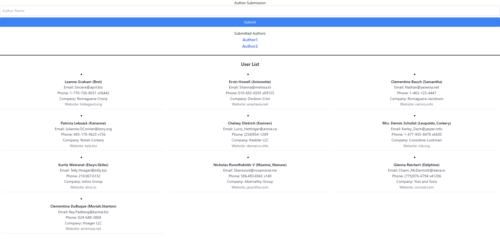
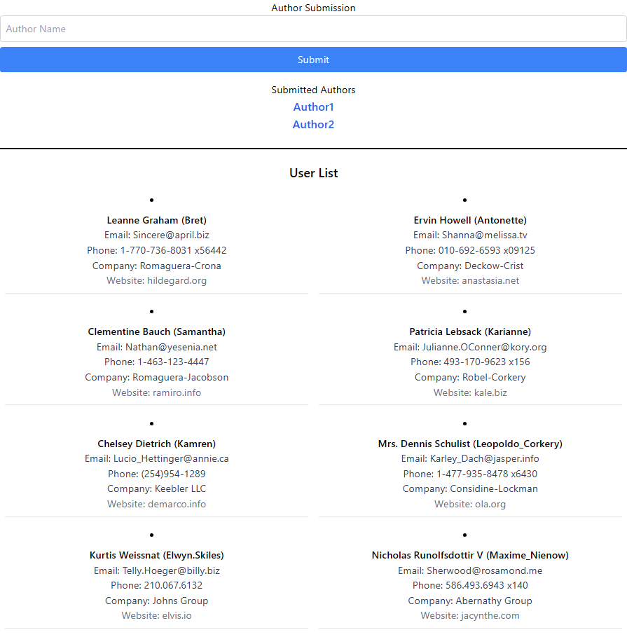
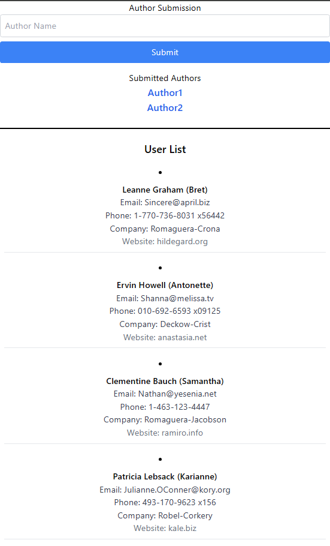

# Setup 

1. Clone repository

```bash
git clone https://github.com/Sele3/assessment1.git
cd assessment1
```

2. Install dependencies

```bash
npm install
```

3. Start the server

```bash
npm start
```

# Technologies Used

- **ReactJS** as the frontend framework
- **TailwindCSS** for styling
- **Axios** for making API requests

# Screenshots

## Homepage
This section shows and home page and its resizability on different screen sizes.

### Fullscreen View
  
*The application in fullscreen mode, displaying the user list in multiple columns.*

### Medium Screen View
  
*The application in a medium-sized window, where the user list adapts to display in fewer columns.*

### Small Screen View
  
*The application in a small window or mobile view, where the user list stacks items vertically.*
